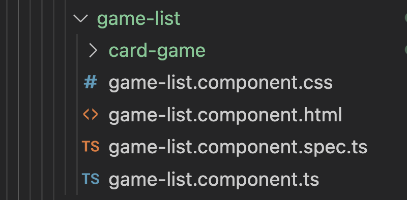

# Routing

Hasta ahora hemos estado apilando componentes directamente en App, pero en una aplicación real solemos dividirla en páginas, para ello Angular nos ofrece el concepto de routing, que nos permite definir componentes que se van a mostrar en función de la url y navegación entre páginas.

En este ejemplo vamos crear una página de listado de juegos (moveremos todo lo que hay en app a esa página) y una página que permite crear un juego.

# Paso a paso

- Partimos del ejemplo anterior, lo copiamos e instalamos las dependencias.

```bash
npm install
```

- Vamos a crear una nueva carpeta que vamos a llamar _pages_, dentro de ella vamos a crear dos componentes, uno para la página de listado de juegos y otro para la página de creación de juegos, para ello ejecutamos los siguientes comandos:

```bash
ng generate component pages/game-list
```

- Vamos ahora a indicarle a la aplicación:
  - Que vamos a utilizar el modulo _@angular/router_
  - Definir las rutas de nuestra aplicación.
  - Asociarlas al router.

_./src/app/app.module.ts_

```diff
import { NgModule } from '@angular/core';
import { BrowserModule } from '@angular/platform-browser';
+ import { RouterModule, Routes } from '@angular/router';

import { AppComponent } from './app.component';
import { CardGameComponent } from './card-game/card-game.component';
import { SellerListComponent } from './seller-list/seller-list.component';

+const appRoutes: Routes = [
+  { path: '', component: CardGameComponent },
+ ];

@NgModule({
  declarations: [
    AppComponent,
    CardGameComponent,
    SellerListComponent
  ],
  imports: [
    BrowserModule,
+  RouterModule.forRoot(appRoutes)
  ],
  providers: [],
  bootstrap: [AppComponent]
})
export class AppModule { }
```

Ahora tenemos que decirle donde va a pintar Angular las ventanas, para ello usaremos el componente _router-outlet_, este componente lo instanciaremos en el _app_ que pasa a ser el componente donde definimos el layout de la aplicación y mostramos la páginas de la ruta actual.

Antes de hacer esto tenemos que pasar todo el contenido de _app_ a _game-list_.

> Fijate que aquí ya empieza a ser una lata trabajar con imports relativos (../../) en el proximo ejemplo vamos a ver como utilizar alias para evitar esto.

_./src/app/pages/game-list/game-list.component.ts_

```diff
import { Component } from '@angular/core';
+ import { Game } from '../../model/game.model';
+ import { Seller } from '../../model/seller.model';
+ import { GameApiService } from '../../services/game-api.service';

@Component({
  selector: 'app-game-list',
  templateUrl: './game-list.component.html',
  styleUrls: ['./game-list.component.css']
})
export class GameListComponent {
+  games: Game[];
+  showSellerList: boolean;
+  sellers: Seller[];
+
+  constructor(private gameApiService: GameApiService) {
+    this.showSellerList = false;
+    this.sellers = [];
+    this.games = [];
+  }
+
+  loadGames = async () => {
+    this.games = await this.gameApiService.getAll();
+  };
+  ngOnInit(): void {
+    this.loadGames();
+  }
+
+  onShowSellerList(sellers: Seller[]) {
+    this.sellers = sellers;
+    this.showSellerList = true;
+  }
+
+  onCloseSellerList() {
+    this.showSellerList = false;
+  }
}
```

_./src/app/app.component.ts_

```diff
import { Component } from '@angular/core';
- import { Game } from './model/game.model';
- import { Seller } from './model/seller.model';
- import { GameApiService } from './services/game-api.service';

@Component({
  selector: 'app-root',
  templateUrl: './app.component.html',
  styleUrls: ['./app.component.css'],
})
export class AppComponent {
  title = 'game-catalog';
-  games: Game[];
-  showSellerList: boolean;
-  sellers: Seller[];

+  constructor() {
-  constructor(private gameApiService: GameApiService) {
-    this.showSellerList = false;
-    this.sellers = [];
-    this.games = [];
-  }

-  loadGames = async () => {
-    this.games = await this.gameApiService.getAll();
-  };

  ngOnInit(): void {
-    this.loadGames();
  }

-  onShowSellerList(sellers: Seller[]) {
-    this.sellers = sellers;
-    this.showSellerList = true;
-  }

-  onCloseSellerList() {
-    this.showSellerList = false;
-  }
}
```

Y hacemos lo mismo con el HTML

_./src/app/pages/game-list/game-list.component.ts_

```diff
+ <div *ngFor="let game of games">
+  <app-card-game
+    [game]="game"
+    (showSellerList)="onShowSellerList($event)"
+  ></app-card-game>
+ </div>
+
+ <app-seller-list
+  *ngIf="showSellerList"
+  (close)="onCloseSellerList()"
+  [sellers]="sellers"
+ ></app-seller-list>
```

_./src/app/app.component.html_

```diff
<h1>My application</h1>
<h2>{{ title + "(" + title.length + ")" }})</h2>

- <div *ngFor="let game of games">
-  <app-card-game
-    [game]="game"
-    (showSellerList)="onShowSellerList($event)"
-  ></app-card-game>
- </div>
-
- <app-seller-list
-  *ngIf="showSellerList"
-  (close)="onCloseSellerList()"
-  [sellers]="sellers"
- ></app-seller-list>
```

- Vamos a actualizar el router para que apunte a nuestra página:

_./src/app/app-routing.module.ts_

```diff
import { SellerListComponent } from './seller-list/seller-list.component';
import { GameListComponent } from './pages/game-list/game-list.component';
import { GameEditComponent } from './pages/game-edit/game-edit.component';

const appRoutes: Routes = [
-  { path: '', component: CardGameComponent },
+  { path: '', component: GameListComponent },
];
```

- Ahora que tenemos el app limpio, vamos a añadir el router-outlet:

_./src/app/app.component.html_

```diff
<h1>My application</h1>
<h2>{{ title + "(" + title.length + ")" }})</h2>

+ <router-outlet></router-outlet>
```

- Vamos a comprobar si sigue viendo la página:

```bash
ng-serve
```

Antes de seguir, vamos a hacer un pequeño refactor para que todo lo que hay dentro de la página de _game-list_ quede dentro de esa carpeta:

Vamos a crear una subcarpeta components y dentro de ella metemos game_card:



Si todo va bien, VSCode habrá hecho las actualizaciones de imports pertinentes, si no hay que arreglar los imports.

Más adelante podríamos plantear una refactorización de más calado:

- Podríamos mover los modelos y servicios locales a esa página a su carpeta.
- Podríamos plantear crear un módulo por página.

Vamos ahora a definir una página para editar y crear un juego.

- Debajo de pages vamos a crear una página de edición de juegos, vamos a crearlo

```bash
ng g c pages/game-edit
```

- Vamos a añadirlo a la sección de rutas

_./src/app/app.module.ts_

```diff
import { GameListComponent } from './pages/game-list/game-list.component';
+ import { GameEditComponent } from './pages/game-edit/game-edit.component';

const appRoutes: Routes = [
  { path: '', component: GameListComponent },
+  { path: 'edit', component: GameEditComponent },
];
```

Para ver que todo funciona, vamos a probar a navegar a la página de edición, ruta:
\_http://localhost:4200/edit

- Si te fijas en el propio app podríamos definir el layout de la aplicación (las página maestras), vamos a aprovechar y crear un header que tenga un enlace a la funcionalidad de crear un nuevo juego.

En este header metemos dos enlace (a la página de list y a la de crear juego), fijate que al _anchor_ de html le informamos con una directiva para que haga la navegación Angular (navegación SPA) a la página de edit.

_./src/app/app.component.html_

```diff
-<h1>My application</h1>
- <h2>{{ title + "(" + title.length + ")" }})</h2>
+ <header>
+   <nav>
+   <a routerLink="/">Game List</a>
+   <a routerLink="/edit">Create new game</a>
+   </nav>
+ </header>
<router-outlet></router-outlet>
```

Vamos a darle un poco de estilo al navbar:

_./src/app/app.component.scss_

```diff
label {
  font-weight: bold;
}

+ nav {
+  display: flex;
+  justify-content: flex-start;
+  column-gap: 15px;
+  padding: 10px;
+  background-color: #fcfaea;
+  border-bottom: 1px solid #e5e5e5;
}
```

Aquí le estamos indicando:

- Que nav va a ser un contenedor flex.
- Que alineamos los elementos a la izquierda.
- Que dejamos un espacio de 15px entre elementos.
- Le indicamos un color de fondo, y una línea en la parte de abajo del rectángulo.

Si te fijas podemos navegar entre una página y otra.

Vamos ahora a por otro escenario, queremos que cuando pulsemos sobre la foto de un juego,
naveguemos a la página de edición, aquí tenemos dos desafíos:

- Por un lado navegar por código a la página de edición.
- Por otro lado, pasarle el id del juego a la página de edición.

Para ellos nos vamos al componente _gamecard_ y en el HTML añadimos un evento click sobre la imagen del juego:

_./src/app/pages/game-list/components/card-game/card-game.component.html_

```diff
<div class="card_image">
  
</div>
```

Y en el ts implementamos este método:

_./src/app/pages/game-list/components/card-game/card-game.component.ts_

```diff
import { Component, EventEmitter, Input, Output } from '@angular/core';
+ import { Router } from '@angular/router';
import { Game } from '../../../model/game.model';
import { Seller } from '../../../model/seller.model';

@Component({
  selector: 'app-card-game',
  templateUrl: './card-game.component.html',
  styleUrls: ['./card-game.component.css'],
})
export class CardGameComponent {
  @Input() game!: Game;
  @Output() showSellerList = new EventEmitter<Seller[]>();

+ constructor(private router: Router) {}

  onTitleClick() {
    this.showSellerList.emit(this.game.sellers);
  }

+ handleImageClick() {
+   router.navigate(['/edit', this.game.id]);
+ }
}
```

Si intentamos ejecutar esto, nos dará un error si intentamos navegar, esto es porque tenemos que definir en la ruta el parámetro id, para ello añadimos una ruta con el parámetro:

_./src/app/app.module.ts_

```diff
const appRoutes: Routes = [
  { path: '', component: GameListComponent },
  { path: 'edit', component: GameEditComponent },
+  { path: 'edit/:id', component: GameEditComponent },
];
```

Y podemos leer ese parametro desde la página de edición:

_./src/app/pages/game-edit/game-edit.component.ts_

```diff
import { Component } from '@angular/core';
+ import { ActivatedRoute } from '@angular/router';

@Component({
  selector: 'app-game-edit',
  templateUrl: './game-edit.component.html',
  styleUrls: ['./game-edit.component.css']
})
export class GameEditComponent {
+ id : string;
+ constructor(private route: ActivatedRoute) {}
}
```

Y ahora para leerlo, tenemos que suscribirnos al evento _params_ del _ActivatedRoute_:

```diff
constructor(private route: ActivatedRoute) {
+   this.route.params.subscribe(params => {
+     this.id = params.id;
+   });
}
```

> Aquí estamos usando observables, más adelante aprendemremos a usarlos.

Vamos a mostrar esta entrada en el HTML:

_./src/app/pages/game-edit/game-edit.component.html_

```diff
<p>game-edit works!</p>
+ <p>Id: {{id}}</p>
```

# ¿Te apuntas a nuestro máster?

Si te ha gustado este ejemplo y tienes ganas de aprender Front End
guiado por un grupo de profesionales ¿Por qué no te apuntas a
nuestro [Máster Front End Online Lemoncode](https://lemoncode.net/master-frontend#inicio-banner)? Tenemos tanto edición de convocatoria
con clases en vivo, como edición continua con mentorización, para
que puedas ir a tu ritmo y aprender mucho.

También puedes apuntarte a nuestro Bootcamp de Back End [Bootcamp Backend](https://lemoncode.net/bootcamp-backend#inicio-banner)

Y si tienes ganas de meterte una zambullida en el mundo _devops_
apúntate nuestro [Bootcamp devops online Lemoncode](https://lemoncode.net/bootcamp-devops#bootcamp-devops/inicio)

```

```
